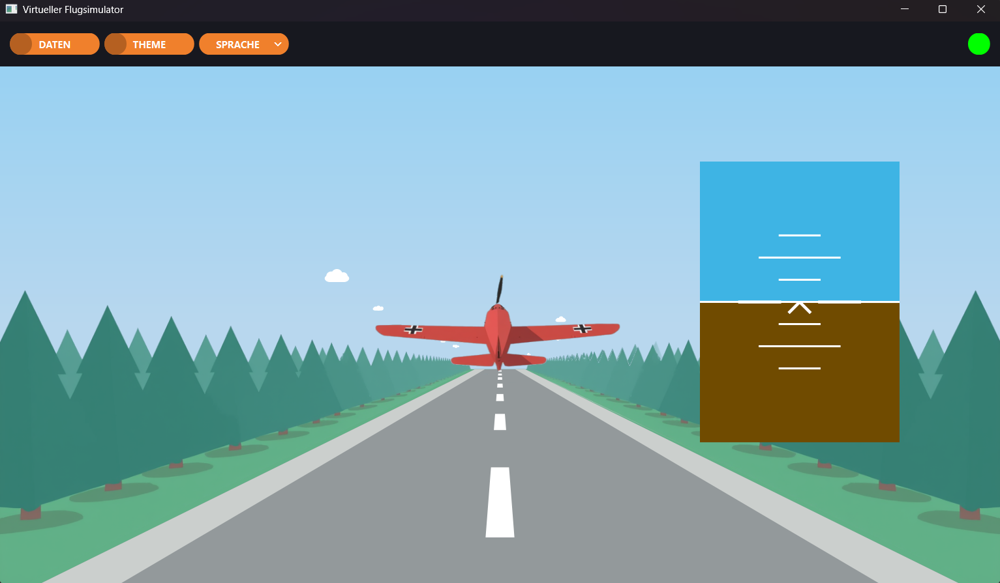
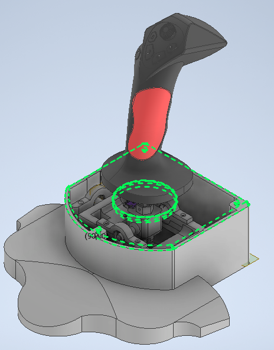

# Virtual Cockpit Simulator - C++/Qt Desktop Application

Implementation of a virtual cockpit simulator. The core application handles animated aircraft visualization, real-time telemetry data processing and hardware state synchronization. I intentionally avoided heavy 3D graphics frameworks like OpenGL or Qt3D, opting instead for a custom 2.5D engine built entirely with **QPainter**. The system receives data via UART from a self-designed physical flight controller, processes it through a custom kinematic flight model, and renders interactive aircraft deflections alongside real-time parameter charts.

# Key Features

- **Custom graphics engine:** Direct rendering of the flight environment and aircraft using `QPainter`. Utilizes spatial perspective transformations via `QTransform::quadToQuad` to simulate 3D depth and geometric hull deformation, significantly reducing CPU/GPU overhead.

- **Flight physics & Auto-leveling:** Dedicated mathematical model (`FlightMathModel`) that processes raw joystick input into smooth pitch and roll transitions. Implements automated auto-leveling algorithms that stabilize the aircraft when user input is released.

- **Real-time telemetry & HUD:** Vector-based Artificial Horizon (`VirtualHorizon`) mimicking professional aviation HUDs, tightly coupled with a dedicated data module (`FlightDataArea`) that renders live parameter deflection charts.

- **Watchdog communication:** Low-level serial port connection managed by `ControllerManager` using `QSerialPort`. Features a background watchdog thread for automatic port scanning and seamless hot-plugging/reconnection.

- **Modular UI architecture:** Multi-page layout split into standalone interface classes (`MainPage` and `DataPage`), managed dynamically via `QStackedWidget` for fluid screen transitions and responsive resizing.

- **Startup verification overlay:** An interactive `EntryOverlay` blocking simulation start until a valid hardware controller is detected, providing visual connection statuses and automated port discovery.

# Tools & Platform

- **Framework:** Qt 6 (QtWidgets, QSerialPort)

- **Language:** C++

- **CAD & Modeling:** Autodesk Inventor (for the mechanical joystick assembly)

- **Hardware interface:** Custom dual-axis joystick utilizing a physical Cardan joint with custom cam profiles and progressive resistance springs.

- **Communication protocol:** UART / Serial Port (custom data frame and searching procedure)

# Hardware Design

Mechanical layout and kinematic assembly of the custom 3D-printed flight controller:

